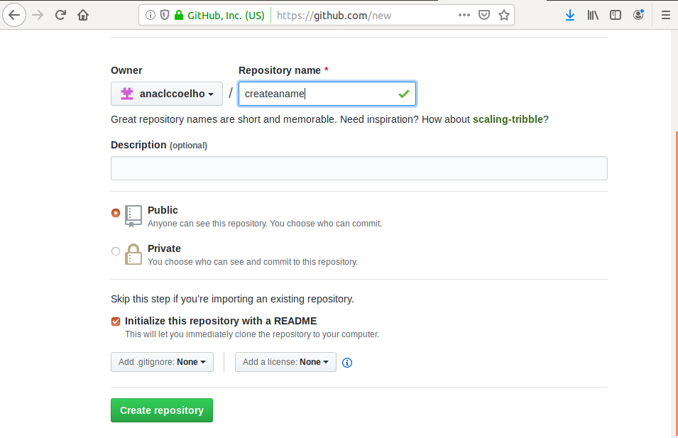
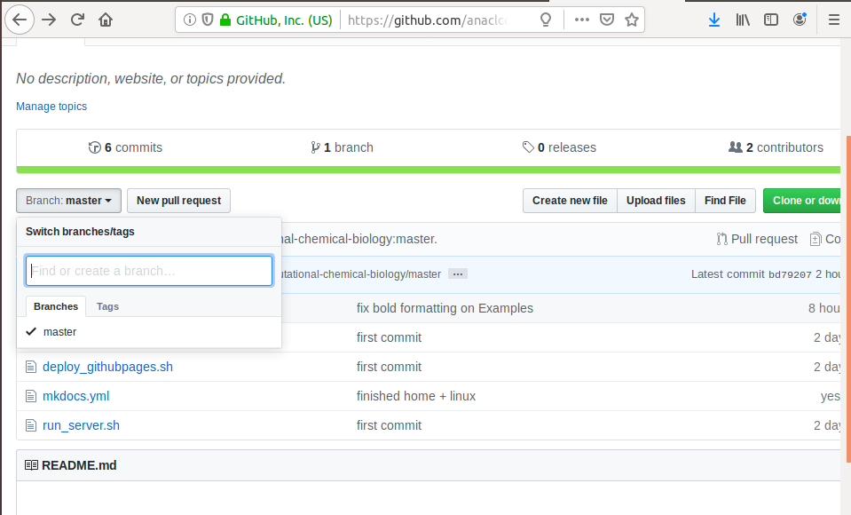
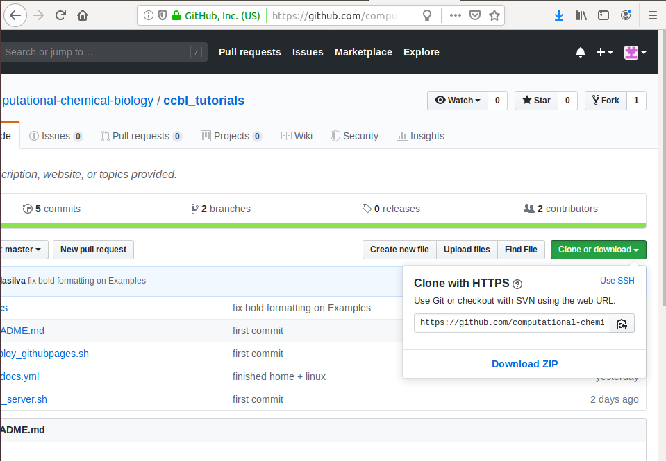
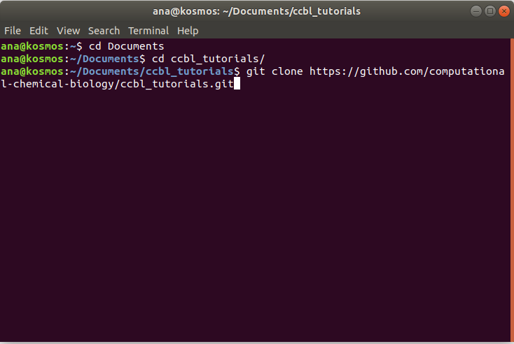
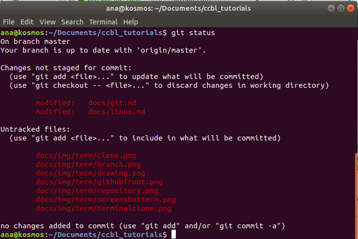
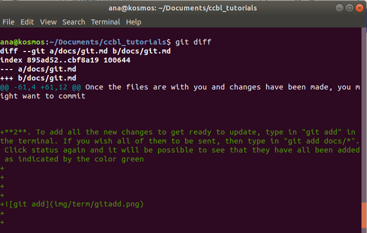
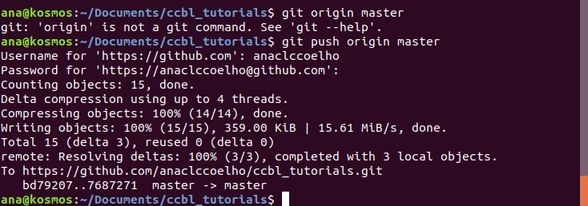

# GIT

##WHAT IS GIT?
Git was created to help during software development by being a ***distributed version control system*** so that tracking code modifications is possible. This makes things easier when collaborating with different groups of people  because noticing where the changes happened is very efficient.

##GITHUB
Github is a code hosting platform where you can manage your git repositories. It is very simple to start using the platform, all you have to do is create an account on their website: 

- [https://github.com/](https://github.com/)

##CREATING A REPOSITORY
To begin your project, a repository needs to be created. It can contain folders, files, videos, spreadsheets and data sets. Including a README is also recommended so that when sharing your project with others there is information on what exactly it is about.

**1**. Once you're logged in, click on the button "New"


**2**. The page below will appear and you will configure the repository the way you prefer by applying a title, a short description and clicking on "Initialize this repository with a README" before finishing with "Create repository".




##CONNECTING 
To work in your repository files directly from your terminal, first you must connect your GitHub account, configurating it through the following command:

 ```git config --global user.email "you@example.com"  (Use the email you registered on GitHub)
 ```
  
 ```git config --global user.name "Your Name" (The username you chose for your GitHub account)
 ```
 

After connecting, when pushing your commits to the repository you will simply log in through your GitHub username and password through the terminal!

##BRANCHING

Branching is a very useful way to work on different versions of a project at the same time without altering the original version. Once the changes are done, you might want to add these changes to the original and that is possible by pulling in those updates.

**1**. To create a branch is very simple, once you are on the main page of your repository, just click on "Branch:master" and fill out the black space with the new name of the branch.





Another possibility is cloning someone else's repository so that you have the data with you so that changes can be made.

**1**. To do this, enter the repository you wish to clone and click on the button "Clone or download". A small window will open and you will copy the url that appears.





**2**. Open your terminal and go to the directory that you wish to clone the repository into. Type in git clone and the url you copied above. Press enter and your local clone will be created.





##MAKE AND COMMIT CHANGES
Once the files are with you and changes have been made, you might want to commit them and send it to Github. All you have to do is the following:

**1**. Check the status of the repository in relation to what you've changed and what stayed the same by inserting in the terminal "git status"





**2**. To add all the new changes to get ready to update, type in "git add" in the terminal. If you wish all of them to be sent, then type in "git add docs/*". Click status again and it will be possible to see that they have all been added as indicated by the color green


**3**. You can also compare what has changed and what stayed the same by typing in "git diff", as shown below





**4**. Preparing to commit is easy, just type in "git commit -a -m "description of choice".


**5**. Finish by typing "git push origin master"; It will be asked for you to login into your GitHub account.





Then go to the Github website and click on "Open a pull request". Then, your pull request will be revised before being merged into the original file.


##REFERENCES


- [https://guides.github.com/activities/hello-world/](https://guides.github.com/activities/hello-world/)


