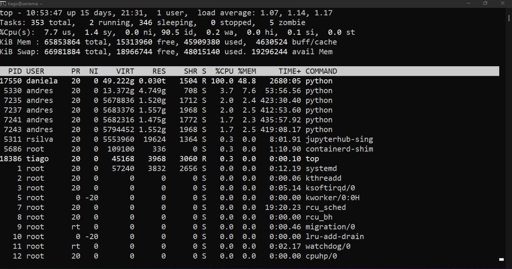
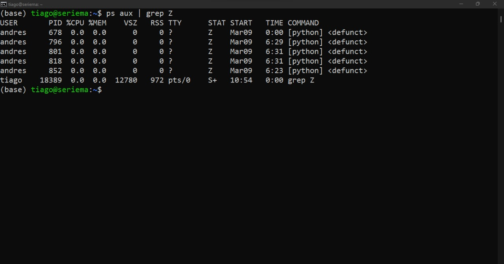

## How to manage your processes in linux terminal

**How to connect to CCBL server**

The first step to connect to the server is to open the linux terminal or the command prompt in windows. Just press `ctrl+al+t` to open linux terminal or search for “cmd” on windows toolbar. Once the black is screen open, use the [SSH protocol](https://computational-chemical-biology.github.io/ccbl_tutorials/ssh/) (Secure Shell) to connect to the remote server:

```
ssh user@seriema.fcfrp.usp.br 

```


Then type your password and press enter.

On the server use the `top` command to see a list of running processes.

```
top
```



**zombie processes**

Now you can see who is online and the process ID (pid) running. Sometimes a few remain open even after the task is done, so it is necessary to close them to avoid RAM overuse. To find the zombies press `ctrl+c` to exit top and type the following combination of commands on terminal:

```
ps aux | grep Z
```
It returns a list of processes that you must kill



Then type the `kill` command followed by the `process id (pid)` you want to terminate:

```
kill -s SIGCHLD pid
```

That's it. You have killed the zombies.
